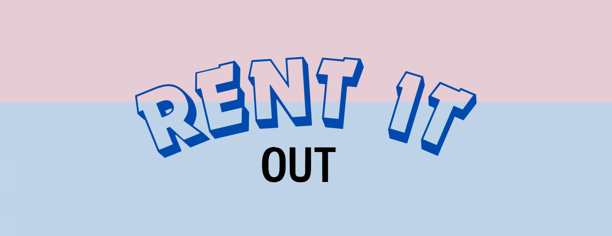

      
<h1>✨ WELCOME TO ✨</h1>
    
  

   
  <h1>Peer-to-Peer Rental Platform for Everyday Items</h1> &nbsp; 

  

 
 

## 🌟 About the Project
<strong>RentItOut</strong> is a peer-to-peer rental platform designed to make renting everyday items easy, reliable, and efficient. It connects people who have items to rent with those who need them, facilitating a convenient and cost-effective way to access products without purchasing them. The goal is to create a circular economy that encourages sharing and reduces the need for people to purchase items they only need occasionally.
 
 
 

  
<h2>💳 Table of Contents<h2\>

  <ol>
    <li><a href="#intro">Introduction (What's RentItOut?)</a></li>
    <li><a href="#coref">Core Features</a></li>
    <li><a href="#addf">Additional Features</a></li>
    <li><a href="#roles">Roles</a></li>
    <li><a href="#bw">Built With</a></li>
    <li><a href="#gs">Getting Started</a></li>
    <li><a href="#API">API Documentation</a></li>
    <li><a href="#demo">Demo</a></li>
    <li><a href="#contribution">Contribution</a></li>
    <li><a href="#contact">Contact</a></li>
  </ol>

  
  
  

 

## 2. Main Features
### Item Listings for Rent
- 🛠️ <strong> Allow users to list items they rarely use, such as tools, electronics, sports equipment, and more. Listings can be organized into various categories to facilitate item discovery.</strong>
By implementing CRUD operations to create, retrieve, update, and delete item listing and developing endpoints to handle different categories, enabling efficient filtering and searching.
  
### Rental Management and Pricing
- 📊 **Feature Explanation**: 
- 💻 **Implementation**: 

### Trust, Safety, and Verification
- 🔍 **Feature Explanation**: 
- 🛡️ **Implementation**:
  
### Logistics: Delivery and Pickup
- 🚚 **Feature Explanation**:
- 📦 **Implementation**:

### Revenue Model and Insurance
- 💰 **Feature Explanation**: 
- 🛡️ **Implementation**: 

### User Experience and Recommendations
- ⭐ **Feature Explanation**: 
- 🧠 **Implementation**: 

[Go to Top](#table-of-contents)

## 3. Additional Features
 add content here.............

  
  
  

