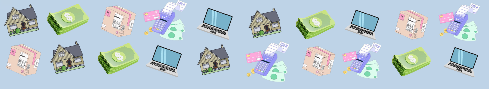

      
<h1>✨ WELCOME TO لما عمتي✨</h1>
    
  

   
  <h1>Peer-to-Peer Rental Platform for Everyday Items</h1> &nbsp; 

  

 
 

## 🌟 About the Project
<strong>RentItOut</strong> is a peer-to-peer rental platform designed to make renting everyday items easy, reliable, and efficient. It connects people who have items to rent with those who need them, facilitating a convenient and cost-effective way to access products without purchasing them. The goal is to create a circular economy that encourages sharing and reduces the need for people to purchase items they only need occasionally.
 
 
 

  
<h2>💳 Table of Contents<h2\>

  <ol>
    <li><a href="#intro">Introduction (What's RentItOut?)</a></li>
    <li><a href="#coref">Core Features</a></li>
    <li><a href="#addf">Additional Features</a></li>
    <li><a href="#roles">Roles</a></li>
    <li><a href="#bw">Built With</a></li>
    <li><a href="#gs">Getting Started</a></li>
    <li><a href="#API">API Documentation</a></li>
    <li><a href="#demo">Demo</a></li>
    <li><a href="#contribution">Contribution</a></li>
    <li><a href="#contact">Contact</a></li>
  </ol>

  
  
  

 

## 2. Main Features
### 🛠️ Item Listings for Rent
- <strong> Allow users to list items they rarely use, such as tools, electronics, sports equipment, and more. Listings can be organized into various categories to facilitate item discovery.</strong>This was done by implementing CRUD operations to create, retrieve, update, and delete item listing and developing endpoints to handle different categories, enabling efficient filtering and searching.
   
  
### 📊 Rental Management and Pricing
- <strong> Manage rental durations, set flexible pricing models, and allow users to specify rental periods and conditions. </strong>Define pricing and duration models in the backend by using database tables to store rental rates and durations, and develop endpoints to handle rental availability, pricing rules, and extensions.
   

### 🛡️ Trust, Safety, and Verification
- <strong> User verification, rating, and review systems to ensure safe and reliable transactions. Develop mechanisms for security deposits or damage protection. </strong>Integrate identity verification for users, potentially via third-party verification APIs. 
   
  
### 🚚 Logistics: Delivery and Pickup
- <strong> Provide options for delivery or in-person pickup, with the potential for location-based matchmaking to facilitate exchanges. </strong>Integrate map-based location services to assist with pickup arrangements and delivery logistics.
   

### 💰 Revenue Model and Insurance
- <strong> Define how the platform generates revenue, such as through service fees. Integrate insurance or damage protection. </strong>Calculate and implement platform fees or commissions for each transaction. 
   

### ⭐ User Experience and Recommendations
- <strong> Enhance the user experience by offering personalized recommendations and a user-friendly interface.</strong> Leverage data on user interactions and item popularity to provide recommendations. 
   
  
  
  

# 👥 Roles:
- 👤 **Renter**: Users who rent out items.
- 👥 **Borrower**: Users who borrow items.
- 🔧 **Admin**: Users who manage the platform.
- 🏬 **Store Owner**: Users who own stores and rent items.
- 🏷️ **Supplier**: Users who supply items for rent.
- 💼 **Beneficiary**: Users who benefit from rented items.
   
  
  

## 🏡 Built With
* [![SpringBoot][Spring-boot]][SpringURL]  An open-source Java framework for creating stand-alone, production-grade applications.
* [![Postman][Postman]][PostmanURL]  A collaboration platform for designing, testing, and documenting APIs.
* [![Github][Github]][GithubURL]  A web-based platform for version control and collaboration using Git.
 

(<a href="#readme-top">⬆️ Back to top</a>)

 

[Spring-boot]: https://img.shields.io/badge/Spring%20Boot-6DB33F?style=for-the-badge&logo=spring-boot&logoColor=white
[SpringURL]: https://spring.io/projects/spring-boot
[Docker]: https://img.shields.io/badge/Docker-2496ED?style=for-the-badge&logo=docker&logoColor=white
[DockerURL]: https://www.docker.com/
[GoogleCloud]: https://img.shields.io/badge/Google%20Cloud%20SQL-4285F4?style=for-the-badge&logo=google-cloud&logoColor=white
[GoogleCloudURL]: https://cloud.google.com/?hl=en
[Rabbit]: https://img.shields.io/badge/RabbitMQ-FF6600?style=for-the-badge&logo=rabbitmq&logoColor=white
[RabbitURL]: https://www.rabbitmq.com/
[GithubURL]: https://github.com/
[Postman]: https://img.shields.io/badge/Postman-FF6C37?style=for-the-badge&logo=postman&logoColor=white
[PostmanURL]: https://www.postman.com/
[Bootstrap.com]: https://img.shields.io/badge/Bootstrap-563D7C?style=for-the-badge&logo=bootstrap&logoColor=white
[Bootstrap-url]: https://getbootstrap.com
[wewe]: https://github.com/Mohammad-Aker/GreenThumb
[JQuery-url]: https://jquery.com 

[Github]: https://user-images.githubusercontent.com/25181517/192108374-8da61ba1-99ec-41d7-80b8-fb2f7c0a4948.png
